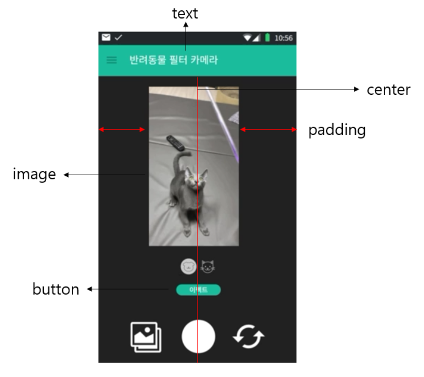
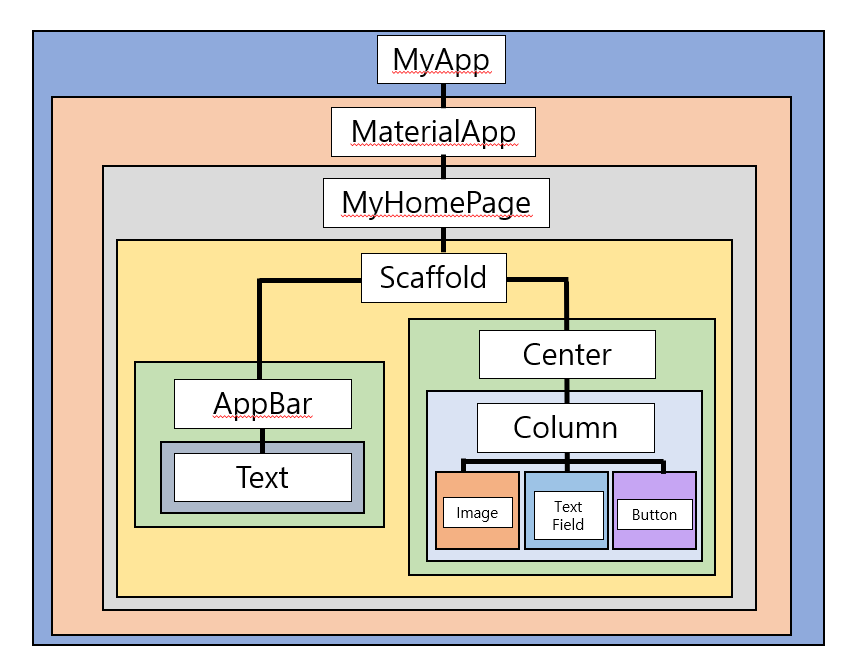

# What is Widget?

## Widget 이란?

1. 독립적으로 실행되는 작은 프로그램
2. 주로 바탕화면 등에서 날씨나 뉴스, 생활정보 등을 보여준다.
3. 그래픽이나 데이터 요소를 처리하는 함수를 가지고 있다.

### Flutter에서 위젯이란?
UI를 만들고 구성하는 모든 기본 단위 요소를 말하며 이는 눈에 보이지 않는 요소도 포함한다.
예를 들면 밑 사진에서(작년에 프로젝트 기획을 하면서 간단하게 만든 프로토타입)인데 text, image, button 요소 하나하나를 위젯이라고 하며, 가운데 정렬(center), padding과 같은 레이아웃 요소까지 모두 위젯에 들어간다고 볼 수 있다.

물론 앱 자체도 위젯이다.
결국 Flutter에서 위젯이란 Flutter를 구성하는 모든 것이라고 생각하면 된다.

## Widget의 종류
1. Stateless Widget : 상대가 없는 정적인 위젯
    1. 스크린상에 존재만 할 뿐 아무것도 하지 않음
    2. 어떠한 실시간 데이터도 저장하지 않음
    3. 어떤 변화(모양, 상태)를 유발시키는 value 값을 가지지 않음
    
2. Stateful Widget : 계속 움직임이나 변화가 있는 위젯
    1. 사용자의 interaction에 따라서 모양이 바뀜(ex. radio button, check box 등)
    2. 데이터를 받게 되었을 때 모양이 바뀜(ex. textEdit)
    
3. Inherited Widget

## Flutter Widget Tree
1. Widget들은 tree 구조로 정리될 수 있음
2. 한 Widget내에 얼마든지 다른 widget들이 포함될 수 있음
3. Widget은 부모 위젯과 자식 위젯으로 구성
4. Parent widget을 widget container라고 부르기도 함

