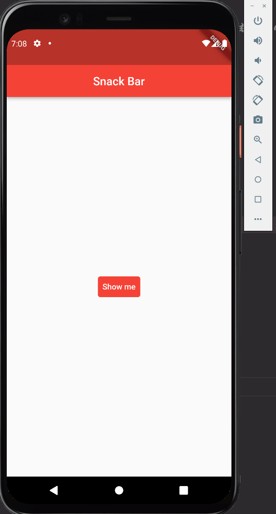

# test04

- SnackBar와 BuildContext
  - `SnackBar` 표시는 `ScaffoldMessenger.of(context).showSnackBar(SnackBar(content: Text('내용 표시')));`가 기본
  - 플러터 2.0부터 SnackBar 표시를 위한 코드에서  Scanffold.of() 대신 ScaffoldMessenger.of() 사용
  - `Scaffold.of()`를 사용하면 페이지 이동 시 스낵바 유지가 불가능했으나 `ScaffoldMessenger`로 변경되면서 가능해졌다. 만약 스낵바 유지를 불가능하게 하고 싶으면 Builder 위젯을 사용하면 된다.
  - 자식 scaffold를 모두 관리하는 `ScaffoldMessenger`는 가장 가까운 Scafford를 반환한다.
  - 마찬가지로 FlatButton도 deprecated 되어 textButton을 대신 사용했다. 
  - TextButton은 styleForm안에서 color를 사용해서 백그라운드 색상을 설정해야 한다.
  
# 결과 화면

