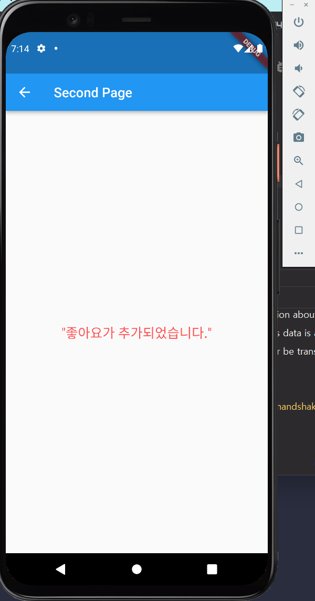
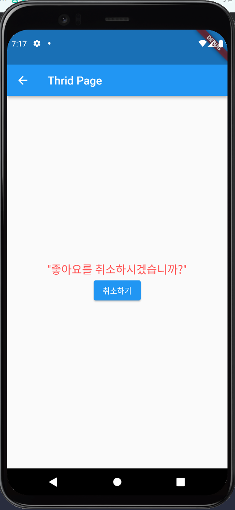

# test04_2

- 플러터 2.0 패치 강좌 : 스낵바(Snack bar)와 ScaffoldMessenger
- 기존 Scaffold.of() 말고 ScaffoldMessenger.of()를 사용했을 때 장점
    - 페이지 이동 시 기존 Snackbar가 남아있고 없고를 조절할 수 있음
    - 유지하지 않도록 하고 싶으면 Builder 위젯 사용

## 첫번째 페이지

## 두번째 페이지
- 첫번째 페이지 버튼을 클릭했을 때 이동

  
## 세번째 페이지
- 첫번째 페이지에서 좋아요 클릭해서 나오는 Snackbar의 undo 클릭
- 취소하기 버튼 클릭하면 Snackbar 보여줌
