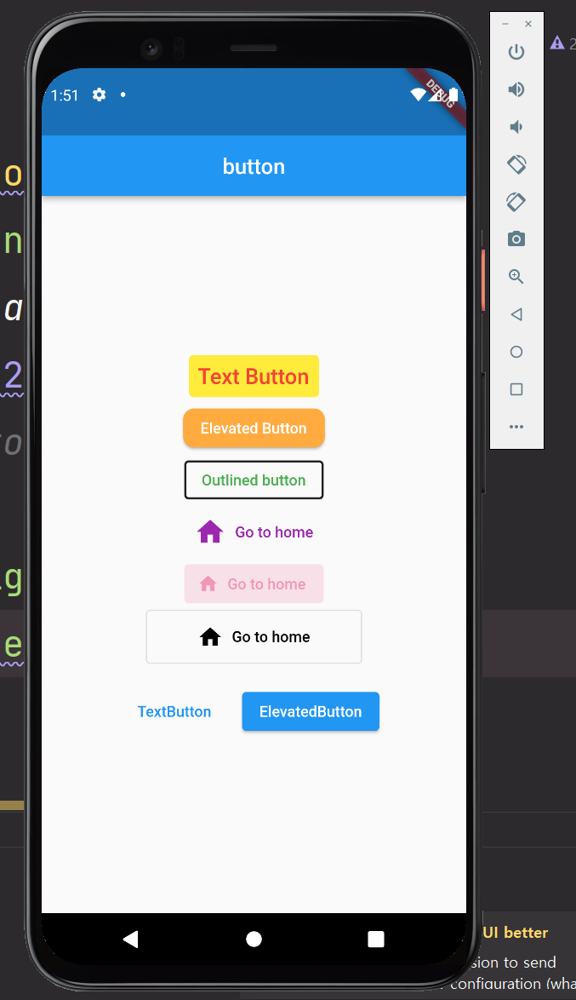

# test08
- 코딩 셰프님 순한맛 강좌 27 : 패치 강좌 2 플러터 2.0 버튼(Elevated button, Text button, Outlined button)

## 플러터 2.0 이후 버튼 종류
- `TextButton` : 배경색과 글자색을 따로 설정해야할 때(primary color가 글자색)
- `ElevatedButton` : 글자색의 디폴트는 흰색 (primary color가 배경색)
- `OutlinedButton` : 버튼의 테두리 색까지 신경써줘야 할 때

## <>Button.icon
- 버튼에 글자와 함께 아이콘을 삽입해야할 때 사용

## Button 관련 기능
- `onPressed : null` // 버튼 비활성화
- `onSurface : Colors.pink` // 비활성화된 버튼 색상 설정
- `ButtonBar` : 두 개 이상의 버튼을 정렬할 때 사용하기 좋은 클래스

## 결과

