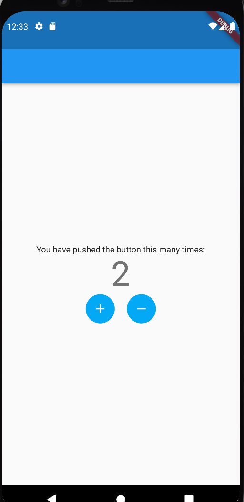

# test09

- [유튜버 코딩 셰프님의 조금 매운맛 강좌 1~2번](https://www.youtube.com/watch?v=StvbitxUKSo&list=PLQt_pzi-LLfoOpp3b-pnnLXgYpiFEftLB) : `Stateful Widget`

## State : UI가 변경되도록 영향을 미치는 데이터
- App 수준과 Widget 수준의 데이터가 있다.
- Stateless Widget : State가 변하지 않는 위젯
  Text('Korea') => Text('France')
  왜? rebuild
    - Widget tree <- Element tree -> Render tree
    - Widget tree : 설계도, 이런 순서와 모양으로 위젯을 그려줘.
    - ★Element tree : 중간에서 Widget tree와 Render tree를 연결
      MyApp <- MyApp element
      Scaffold <- Scaffold element
      AppBar <- AppBar element
      Text <- Text element

      ex. Container <- Containter element
      element는 point의 역할을 수행 + Container 위젯의 정보(위치, 타입, 가로 세로 크기, 배경색 등)
- Reload vs. Rebuild
  변경된 부분만 다시 그리기 vs 화면에 다시 그리기
  위치나 타입 속성 등이 일치할 때 한해서 링크만 업데이트 하기(Reload)
- Are the element tree and render tree rebuilt?
- Rebuild 구조
  Container Widget(white => blue) -> Hot reload ->
  build method -> Widget tree rebuild ->
  Element tree link update -> Element tree' info
  -> Render tree -> Render object re-rendering
- Stateless 위젯은 rebuild만을 통해서 새로운 State 적용 가능
- Flutter는 초당 60프레임 속도

## Extend(상속)

```
class DialPhone {
    int? year;
  
    DialPhone () {
        print('이 전화기는 다이얼을 돌려서 전화를 겁니다.');
    }
    void whenCame() {
        print("1989년 발명");
    }
}

class ButtonPhone extends DialPhone {
    ButtonPhone() {
        print('이 전화기는 버튼을 눌러서 전화를 겁니다.');
    }

    @override
    void whenCame() {
        print("1963년 발명");   
    }
}

class SmartPhone extends ButtonPhone{
    String? manufacturer;
    String? model;

    SmartPhone(String manufacturer, String model, int year) {
        this.manufacturer = manufacturer;
        this.model = model;
        this.year = year;

        print('이 전화기는 터치를 해서 전화를 겁니다.');
    }

    @override
    void whenCame() {
        print("1993년 처음 등장");
    }
}

void main() {
    SmartPhone s1 = SmartPhone('제조사: 삼성,', '모델명 : 갤럭시 s20', 2020);

    print(s1.manufacturer.toString() + " " + s1.model.toString()
    + " " + s1.year.toString());

    s1.whenCame();
}
```

## Stateful widget과 Stateless 비교
- Input Data(external) -> `StatefulWidget` and `Stateless Widget` -> `Build method` 호출 -> Renders UI
- `Stateful Widget`은 `State` 클래스를 가지고 있음 => 두 개의 클래스를 접목시킴
    - `Build method`는 State 클래스가 가지고 있으며 이를 통해 UI를 Rendering 함

## State이 변환될 때
- Child 위젯의 생성자를 통해 데이터가 전달될 때
- Internal state가 바뀔 때

## 수 세기 예제
### `StatelessWidget` -> `StatefulWidget` 변환
- `State`클래스를 제네릭 타입으로 선언하여 연결 => 재사용성 용이
- MyApp 위젯에서 `createState method` 호출 : `statefulWidget`이 생성될 때마다 호출
- `StatefulWidget`인 `CheckBox`
- Text 위젯은 `StatelessWidget` 이므로 `build method` 호출(rebuild)
- `setState method` : 1) 매개변수로 전달된 함수 호출 2) `build method`를 호출
- `setState`가 표시해주는 위젯은 `dirty`
### 새로운 `MyApp Stateful Widget` 생성
- `MyApp Stateful Widget`이 생성되면 `MyApp Stateful element` 자동 생성
- `MyApp Stateful element`는 `MyAppState object`도 생성, 해당 객체는 `MyApp Stateful widget`과 간접적으로 연결
- `setState` 가 호출되면 새로운 `MyApp Stateful widget`가 rebuild => `MyApp State object`의 새로운 `state`가 저장 => `MyApp State object`가 새로운 `MyApp Stateful widget`를 가리킴
- 왜 `MyApp State object`는 `MyApp Stateful widget`처럼 `Widget tree` 상에서 왜 rebuild 되지 않는가? 비용 문제
    ex) 일반 로봇과 변신 로봇
        변신 로봇 : `State object`, -> `Stateful widget`
  
## +, - 추가하기
- `IconButton` 이용
- `IconButton`이 배경색을 가질려면 `Ink`의 `child`로 설정

## 결과 화면
