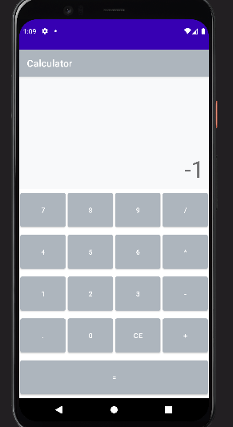

# 계산기 만들기

- 주요 목표 : ui 구성 및 `onClick`으로 기능을 구현하고 문자열을 다룬다.

## UI 만들기
- `Linear Layout` 사용
- `layout_weight`의 사용
- 여기서 `activity_main.xml` 코드에 `onclick`을 사용하나 큰 프로젝트에서 추천하지 않으니 사용하지 말 것.
  (대신 `databinding`이나 `clickListener` 사용을 추천)

## OnClick으로 CLR 구현하기
- `view`의 `text`를 가져올 때는 `view.text`가 아닌 `(view as Button).text`와 같이 사용 (`view`에는 text 속성이 없기 때문에 `view`를 `Button`으로 바꿔야함)
- `activity_main.xml`에서 각 함수의 `onClick`을 설정하지 않았다면 모든 버튼을 `MainActivity.kt`에서 선언하고 모든 버튼에 대한 함수를 지정해줬어야 했다.
- 모범적인 코드는 사용하지 않지만 급하게 만들어야할 때 유용해서 추천

## `OnDecimalPoint()` : 소숫점 입력
- `..` 예외처리
- `flag` : 참인지 거짓인지 판단하는 변수

## `onOperator()` : 연산자 입력
- `isOperatorAdded()` : 음수거나 연산자를 포함하고 있지 않으면 `false`, 그 외 연산자를 포함하고 있으면 `true`
- `onOperator()`는 현재 입력이 숫자로 끝나고, 음수거나 연산자를 포함하고 있지 않으면 수행
- `.contains()`는 문자열에 해당 문자열이 포함되어있는지 Boolean 값을 반환
- `.startWiths()`는 문자열이 해당 문자열로 시작하는지를 Boolean 값을 반환
- `let`은 앞의 코드가 참이면 실행한다. ex. `tvInput?.text?.let {}` // `tvInput`과 `text`가 `null`이 아닐 때 실행
- `let`에서 `it`은 `lambda`의 변수를 뜻한다. 실제로 `let` 사용 시 `it:CharSequence` 코드가 자동생성됨을 볼 수 있다.

## `onEqual()` : Equal 입력
- 연산자로 끝나는지 확인
- 0으로 끝나거나 산술적으로 계산이 힘들 때를 위해 `ArithmeticException` 예외 처리
- 음수일 때를 위해 `prifix` 변수를 활용하여 확인한다.
- `tvInput`의 `text`는 `charSequence` 타입이므로 `toString()`으로 읽어온다.
- `subString(start, end)`은 인덱스 `start`부터 `end`까지 잘라서 반환한다. 

## `removeZeroAfterDot()` : .0으로 끝날때 없애기
- `result.contains(".0")`을 이용해서 확인 후 자르기

## 결과 화면

## 보완 사항
- `removeZeroAfterDot()`에서 `contains()` 대신 `endsWith()`을 사용(0.025와 같은 답이라면 잘못 출력되므로) : 해결
- backspace 기능
- ui
- 연산자를 두 번 이상 사용할 때 문제 발생 : 연산자를 사용할 때마다 결과 보여주기, 결과 위에는 식을 보여주는 `textView` 추가

