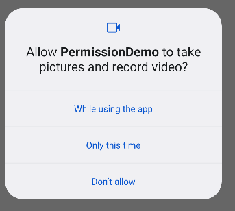
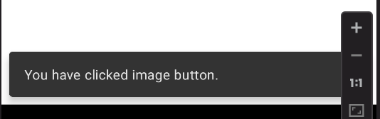
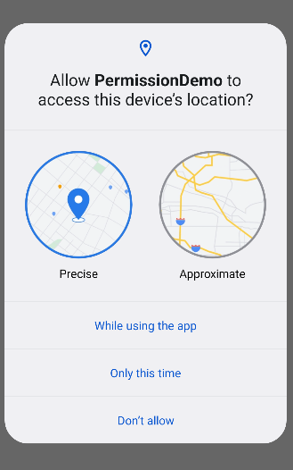
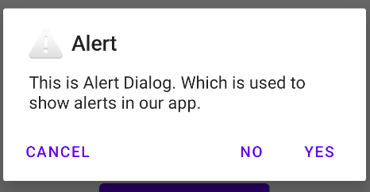
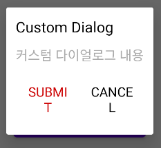
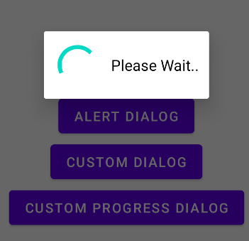
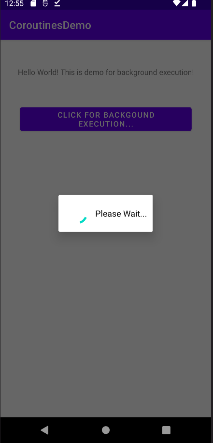
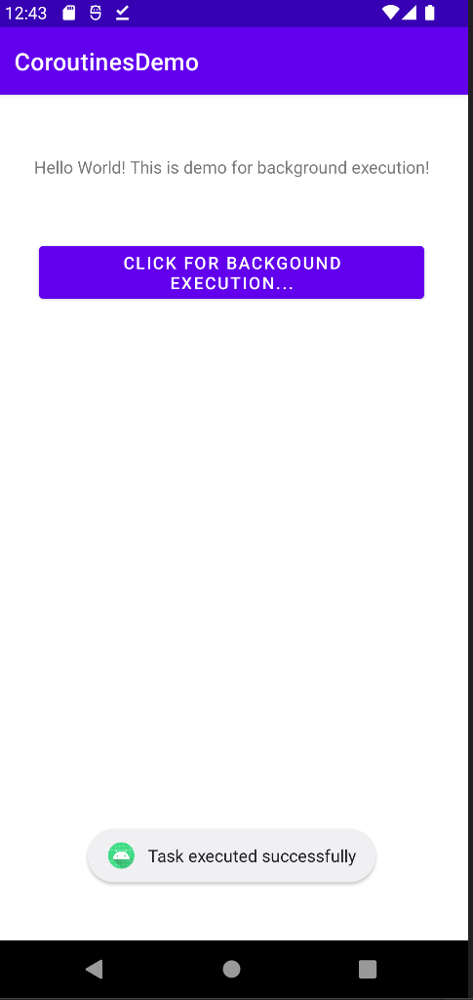
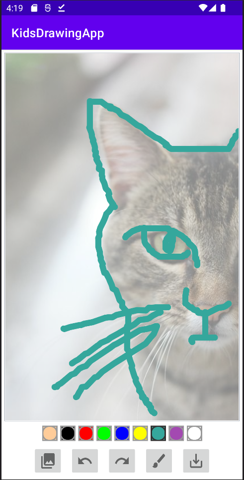

# Kids Drawing App

## 키즈 드로잉 앱 세팅하기 - 드로잉 뷰
- 항상 세로 모드 설정 : `AndroidManifest.xml`에 `android:screenOrientation="portrait"` 추가
- `DrawingView` 클래스
    - `View` 클래스 상속
    - `Path`를 상속받는 `CustomPath` 
      `Path`는 사용자가 그림을 그리는대로 따라옴.
    - `Bitmap`
    - `Paint`
    - `Canvas`
    - `MotionEvent` 클래스
      - `ACTION_DOWN` : 처음 눌렀을 때
      - `ACTION_MOVE` : 누르고 움직였을 때
      - `ACTION_UP` : 누른 걸 뗐을 때
    - `invalidate()` : 뷰가 화면에 보일 때 전체 뷰를 무효화, 그리고 onDraw 실행
    - `OnDraw()` : 화면을 다시 그릴 필요가 있을 때 호출
    
## 화면에 선 계속 보이게 하기
- `mPaths = ArrayList<CustomPath>()` 추가
- 그릴 때마다`path`를 추가하고 `onDraw()` 시 설정

## 캔버스 주변에 작은 보더 추가하기
- `activity_main.xml` 상에서 `view`의 background 추가
- 이 때 constraint layout을 사용하므로 xml에 간격 추가
- 생성된 backgroud xml에서 stroke 설정

## BrushSizeSelector 준비하는 법과 DisplayMetrics를 사용하는 법
- BrushSize 조절
    - `fun setSizeForBrush` 선언
        - 화면 크기 고려 : `TypedValue.applyDimension(uint: Int, value: Float, metrics: DisplayMetrics!)` 사용
        - unit : 사용할 단위, value : 정보값, metrics : 측정 기준
    - `MainActivity.kt`에서 호출 가능
    
## 생성한 커스텀 다이얼로그에서 브러쉬 사이즈 선택하기
- `layout/`에 `dialog_brush_size.xml` 생성
    - `drawable/small.xml` 생성
        - `dither` 속성을 통해 비트맵이 화면과 동일한 픽셀 구성을 가지고 있지 않은 경우 비트맵 디더링을 사용하거나 사용하지 않을 수 있다.
            ex) 여기서는 RGB 구성 사용 -> 실제 사용자 화면은 ARGB 구성 사용할 때 다른 화면에서도 작동하도록 이미지 자동 조정
- `acitivity_main.xml`에 `ImageButton` 추가
    - `ImageButton` 속성 중 `scaleType`을 `fitXY`로 설정하면 드래그할 때 화면 크기에 맞춰진다.
    
## 생성한 커스텀 드러어블을 사용하여 색상 팔레트 추가하기
- `pallet_normal.xml`추가
   - `layer-list` 사용 : `item` 속성을 여러 번 사용하면 겹쳐지는 것을 볼 수 있음
- `pallet_pressed.xml` 추가 : 선택한 색상 강조
- 각각의 생성한 `imageButton` 에 `tag` 속성 추가 : 선택한 버튼이 무엇인지 확인하고 색상을 사용할 수 있도록 만듦. : `stoke`의 색상 바꿈
    - `Linearlayout`에 id를 추가하고 안의 `imageButton`은 `index`로 찾기
        : `linearLayoutPaintColors[1] as ImageButton`
- pallet_normal.xml -> pallet_pressed.xml 로 변경(재정의)
  ```kotlin
      mImageButtonCurrentPaint!!.setImageDrawable(
        ContextCompat.getDrawable(this, R.drawable.pallet_pressed) // 이미지 버튼의 view를 pallet_pressed로 설정
    )
  ```
  
## 색상 선택 추가하기
- `String` 으로 `color` 를 읽어서 `Color.parseColor`로 적용
- cf) [그 외 방법으로 색상 선택하는 방법](https://www.geeksforgeeks.org/how-to-create-a-color-picker-tool-in-android-using-color-wheel-and-slider/)

## 백그라운드 이미지 추가하기
- `frameLayout` : 여러 개의 뷰가 겹쳐질 수 있음

## UI에 갤러리 이미지버튼 추가하기
- LinearLayout 추가하여 기존 브러쉬 버튼과 함께 추가

## 권한 데모
- PermissionsDemo 프로젝트 생성
- `AndroidManifest.xml`에서 `<uses-permission android:name="android.permission.CAMERA"/>` 추가
  이 외에도 위치와 같은 권한을 해당 xml에서 요청 가능

  
## 스낵바 - AlertDialog - 커스텀 다이얼로그 데모 파트
- [스낵바와 토스트의 차이](https://stackoverflow.com/questions/34432339/android-snackbar-vs-toast-usage-and-difference)
### 카메라 권한 요청 화면


### 위치 권한 요청 화면


## 커스텀 다이얼로그
### Alert Dialog 실행화면


### Custom Dialog 실행화면
- ui, 버튼 등 바꾸고 싶을 때 사용


### Custom ProgressBar Dialog 실행화면
- custom Dialog에 progressBar 추가

  
## 키즈드로잉 앱에 앱 권한 요청 추가하기
- API 31 환경에서만 작동
- `permission.READ_EXTERNAL_STORAGE` 권한 추가

## 갤러리에서 이미지 선택하여 백그라운드에 사용하기
- `Intent()`로 다른화면 : 갤러리를 열어 이미지 선택
- ImageView에 적용할 때는 `setImageURL()` 사용
    URL : 기기 안의 위치, 브라우저 상의 경로 개념
- 이미지 자체가 아닌 경로를 사용한다.

## 취소 버튼과 기능 추가하기
- `DrawingView.kt`에 `fun onClickUndo()` 추가
    mUndoPaths에 mPaths의 마지막 인덱스를 추가한 후, `onDraw()`를 재호출해야함
  -> `onDraw()` 호출이 아닌 `invalidate()` 사용하여 내부로 onDraw를 불러옴
  - 전체 페이지를 무효화

## 코루틴을 사용하여 백그라운드에서 무언가 해보기
- 왜 `code routines`가 필요한가?
안드로이드에서는 어떤 작업이 완료되는데 더 오랜 시간이 걸리고 작업이 완료될 때까지 ui가 차단
  ui가 상호작용 x
  사용자는 지루해지는 ... -> 안드로이드는 ui 시스템이 최대 5초까지 지연되도록 함
  - onCreate()에서 버튼을 클릭하면 for문을 100000번 실행, Toast 메시지 출력하는 예제
    -> 비추천 : coroutine을 사용하면 오래 걸리는 작업을 background의 다른 스레드로 넘겨서 ui 스레드가 차단되지 않고 계속 실행 -> 사용자가 막힘없이 앱을 사용할 수 있도록 만듦
- Coroutines Notable Feature
    - Light Weight
      : 서스펜션의 지원으로 단일 스레드에서 많은 코루틴을 실행할 수 있음
    - Fewer Memory Leaks
      : 코루틴과 특정 스코프를 실행하면 스코프 끝에서 종료될 때 누출이 발생하지 않음
    - Built in cancellation support
      : launch 옵션은 실행 중인 코루틴을 취소하는데 사용할 수 있는 작업을 반환하고 JetPack에 통합한다.
    - Jetpack Integration
      : Jetpack Integration -> 번역이 약간 이상한 듯
- Coroutine Scopes
   - 코루틴을 실행하여 최종적으로 이 기능을 실행할 수 있는 스코프 내장
   - but 코루틴 범위 필요, 스텐드 구조화 된 동시성의 원칙에 따라 최신 코루틴은 특정 코루틴 범위에서만 출시된다.
   - 스코프를 생성한 후 마지막에 삭제 하지 않으면 메모리 누출 발생하니 주의
   - viewModelScope
        ```kotlin
            viewModelScope.launch(Dispatchers.IO) {
            try {  
                val client = repository.getCharacters("1")
                charactersLiveData.postValue(ScreenState.Success(client.result))
            } catch (e:Exception) {
                charactersLiveData.postValue(ScreenState.Error(e.message!!, null))
            }
        }
        ```
        - 뷰모델클래스에서 코루틴 실행시 사용
        - 뷰모델이 지워지면 자동으로 취소
   - lifecycleScope
        ```kotlin
        lifecycleScope.launch {
            try {
                val client = ApiClient.apiService.fetchCharacters("1")
            } catch (e: Exception) {
            
            }
        }
        ```
        - 액티비티나 fragment에서 코루틴을 실행시 사용
        - 망가지면 자동으로 취소
        - 라이프사이클이 중단되는 경우 메모리 누수가 발생 x -> good
   - Custom scope
        - 사용자 지정 범위를 만들 수도 있으나 실행이 완료되면 작업에 연결하고 지우는 것이 중요
        - 액티비티에서 작업 변수를 만들려면 글로벌 작업 변수를 만들어서 코루틴 범위 생성, 작업 연결한 다음 실행
        - 마지막으로 액티비티가 중단되면 작업을 취소
        ```kotlin
        private val job = Job()
        CoroutlineScope(Dispatchers.IO + job).launch {
            try {
                val client = ApiClient.apiService.fetchCharacters("1")
            } catch (e: Exception) {
            
            }
        }
        
        override fun onDestroy() {
            super.onDestroy()
            job.cancel
        }  
        ```
- 예제 : 백그라운드에서 for문 만 번 돌리면서 Log 찍은 다음 Toast 실행
    - ktx 종속성 추가
    - `lifecycleScope`를 이용해서 프로그레스 다이얼로그를 보여준 후 
      코루틴 함수 호출, 코루틴 함수 안에서 `withContext()` 사용하여 for문 실행 및 `runOnUiThread` 사용
    - 실행화면
    
    
            
     
## 공급자 추가하기 - 앱에 패스와 이미지 샌드위치 메이커 추가하기
- 이미지 저장 -> 기기에 데이터를 출력해 이미지를 저장할 수 있도록 하는 권한 필요 -> WRITE 권한 추가
- 기기가 데이터를 읽는 것 뿐만 아니라 쓰게 만들기
    - `res/xml/path.xml` 추가
    - `AndroidManifest.xml` 에 provider 추가

## 휴대폰에 있는 이미지를 코루틴과 출력스트림을 사용하여 저장하기
- view를 Bitmap으로 저장 : `fun getBitmapFromView()`
- Bitmap을 file로 저장 : `saveBitmapFile(mBitmap: Bitmap?)`
  -> 리소스를 많이 사용 -> ui 스레드, 메인 스레드 x -> 코루틴 사용
- 스토리지에서 읽을 수 있는 권한이 있는지 확인 : `fun isReadStorageAllowed()`
- 프레임레이아웃을 전달하여 이미지를 저장

## 커스텀 실행 다이얼로그 반영하고 완료 후 숨기기
- `showProgressDialog()` & `cancelProgressDialog()` 추가
- 저장 버튼 클릭 시 실행

## 이메일, 왓츠앱 등으로 이미지를 공유하는 공유 기능 추가하기
- 저장 후 `fun shareImage()` 호출

## 실행 화면
