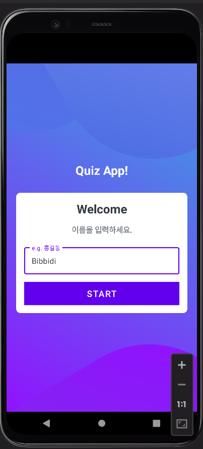
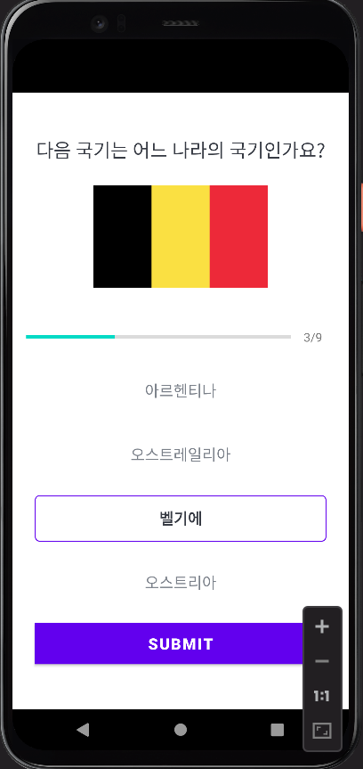
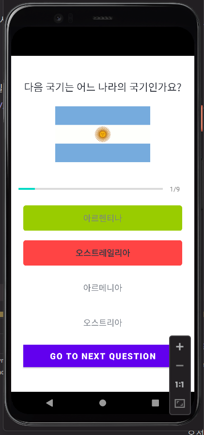
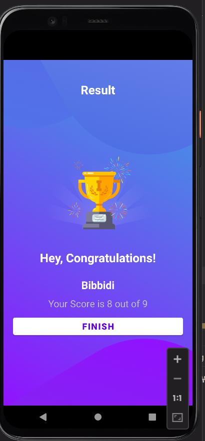

# Quiz 앱 만들기

## 첫 화면 : 이름 입력
- `ActionBar` 없애기
  - `manifests/AndroidManifest.xml` : `Activity` 만들고 설정(ex.어떤 `Activity`로 시작)
  - `AndroidManifest.xml`에서 `android:theme="@style/Theme.MaterialComponents.DayNight.NoActionBar"`로 설정
  - 혹은 `android:theme="@style/Theme.MyQuizApp"`으로 두고 `theme.xml`에서 `<style name="Theme.MyQuizApp" parent="Theme.MaterialComponents.DayNight.NoActionBar">` 로 설정도 가능
- 세로 모드 설정
  - `AnroidManifest.xml`에서 `Activity` 속성에 `android:screenOrientation="portrait"` 추가
- `LinearLayout` 설정
  - `LinearLayout`이 두 개 이상이라면 둘 다 `orientation`을 해주어야 함
- `CardView`
  - `TextInput` 설정
    - `AppCompatEditText`으로 입력값 설정하기 : `hint`, `inputType`
  - `cardCornerRadius` : 둥근 모서리
- 상태바 없애기
  - `themes.xml`에 `<item name="android:windowFullscreen">true</item>` 추가
  
## 질문 모델 생성 및 준비하기
- 버튼 클릭 시 이동
  ```
  val intent = Intent`(this, <이동할 액티비티.kt 이름>::class.java)
  startActivity(intent)
  ```
- finish()를 사용하여 현재 액티비티 종료 가능 ex. 이전을 눌렀을 시 종료하고 싶을 때
- Question 모델 만들기
  - Question Class 만들기 : `Data Class`
    : id, 질문, 이미지, 문항 1~5번, 일치답안
  - 질문 접근 및 허용
    - Constants object 생성
      `getQuestion()` 함수를 추가하여 QuestionList 생성
    - `QuizQuesionsActivity.kt` 에서 `getQuestions()` 호출하여 변수에 반환
    - Log.i()로 Logcat 창에서 작동 확인 가능
      ex. `2022-03-09 00:15:46.449 23850-23850/com.example.myquizapp I/QuestionsList size is: 9`

## ui를 모델에 연결하기
- `ScrollView`-`LinearLayout` 사용
- `ImageView`
  - image 가 안 보일 때 이미지 설명 : `android:contentDescription`
  - tools 만을 위한 이미지 설정 : `tools.src`
- `ProgressBar`
  - `layout_weight`을 0dp로 설정하고 가중치(`layout_weight`)를 부여하지 않으면 표시되지 않음
  - `indeterminate` : 진행 바 고정
- 옵션 선택으로 `TextView` 생성
  - `TextView`의 `backgrond`를 `@drawable/default_option_border_bg`로 설정 시 에러 발생 -> 경고 표시 클릭해서 `default_option_border_bg.xml` 생성
    - `default_option_border_bg.xml`에서 설정을 하고 나면 변경

## 버튼 기능을 질문 활동에 추가하기
- 누른 버튼의 배경색을 설정하는 `selected_option_border_bg.xml` 생성 -> xml 파일은 이미지 처럼 사용할 수 있게 해준다.
- `QuizQuesionsActivity`의 부모 클래스로 Class 안의 아이템을 누를 수 있게 하는 `View.OnClickListener` + `OnClick` 메소드 추가

## Intent
- `Intent.putExtra`

## 결과 화면

### MainActivity


### QuizQuestionsAcitivity



### ResultActivity
